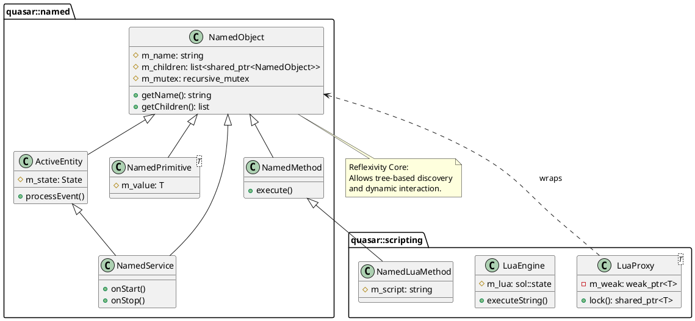
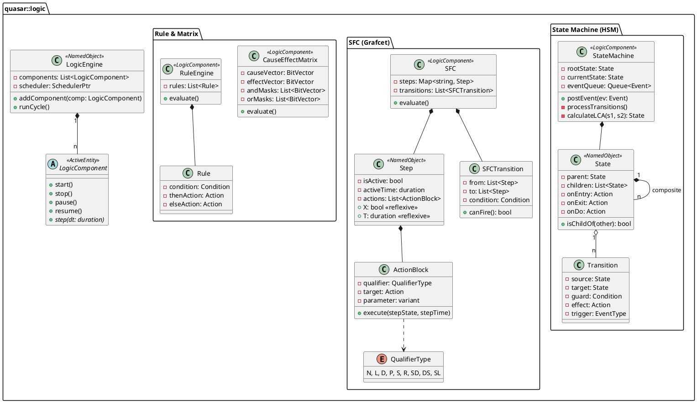
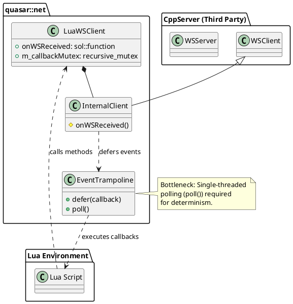

# Architecture Diagrams

This page showcases the PlantUML architecture diagrams for the Quasar framework.

## Core Hierarchy

```plantuml
@startuml
package "quasar::named" {
    class NamedObject {
        # m_name: string
        # m_children: list<shared_ptr<NamedObject>>
        # m_mutex: recursive_mutex
        + getName(): string
        + getChildren(): list
    }

    class ActiveEntity {
        # m_state: State
        + processEvent()
    }

    class NamedPrimitive<T> {
        # m_value: T
    }

    class NamedMethod {
        + execute()
    }

    class NamedService {
        + onStart()
        + onStop()
    }

    NamedObject <|-- ActiveEntity
    NamedObject <|-- NamedPrimitive
    NamedObject <|-- NamedMethod
    NamedObject <|-- NamedService
    
    ActiveEntity <|-- NamedService
}

package "quasar::scripting" {
    class LuaProxy<T> {
        - m_weak: weak_ptr<T>
        + lock(): shared_ptr<T>
    }
    
    class LuaEngine {
        # m_lua: sol::state
        + executeString()
    }
    
    class NamedLuaMethod {
        # m_script: string
    }
    
    NamedMethod <|-- NamedLuaMethod
    LuaProxy ..> NamedObject : wraps
}

note bottom of NamedObject
  Reflexivity Core:
  Allows tree-based discovery
  and dynamic interaction.
end note
@enduml
```

## Logic Engine Models

```plantuml
@startuml Quasar LogicEngine Overview

package "quasar::logic" {
    abstract class LogicComponent <<ActiveEntity>> {
        + start()
        + stop()
        + pause()
        + resume()
        + {abstract} step(dt: duration)
    }

    class LogicEngine <<NamedObject>> {
        - components: List<LogicComponent>
        - scheduler: SchedulerPtr
        + addComponent(comp: LogicComponent)
        + runCycle()
    }

    LogicEngine "1" *-- "n" LogicComponent

    package "State Machine (HSM)" {
        class StateMachine <<LogicComponent>> {
            - rootState: State
            - currentState: State
            - eventQueue: Queue<Event>
            + postEvent(ev: Event)
            - processTransitions()
            - calculateLCA(s1, s2): State
        }

        class State <<NamedObject>> {
            - parent: State
            - children: List<State>
            - onEntry: Action
            - onExit: Action
            - onDo: Action
            + isChildOf(other): bool
        }

        class Transition {
            - source: State
            - target: State
            - guard: Condition
            - effect: Action
            - trigger: EventType
        }

        StateMachine *-- State
        State "1" *-- "n" State : composite
        State "1" o-- "n" Transition
    }

    package "SFC (Grafcet)" {
        class SFC <<LogicComponent>> {
            - steps: Map<string, Step>
            - transitions: List<SFCTransition>
            + evaluate()
        }

        class Step <<NamedObject>> {
            - isActive: bool
            - activeTime: duration
            - actions: List<ActionBlock>
            + X: bool <<reflexive>>
            + T: duration <<reflexive>>
        }

        class ActionBlock {
            - qualifier: QualifierType
            - target: Action
            - parameter: variant
            + execute(stepState, stepTime)
        }

        enum QualifierType {
            N, L, D, P, S, R, SD, DS, SL
        }

        class SFCTransition {
            - from: List<Step>
            - to: List<Step>
            - condition: Condition
            + canFire(): bool
        }

        SFC *-- Step
        SFC *-- SFCTransition
        Step *-- ActionBlock
        ActionBlock ..> QualifierType
    }

    package "Rule & Matrix" {
        class CauseEffectMatrix <<LogicComponent>> {
            - causeVector: BitVector
            - effectVector: BitVector
            - andMasks: List<BitVector>
            - orMasks: List<BitVector>
            + evaluate()
        }

        class RuleEngine <<LogicComponent>> {
            - rules: List<Rule>
            + evaluate()
        }

        class Rule {
            - condition: Condition
            - thenAction: Action
            - elseAction: Action
        }

        RuleEngine *-- Rule
    }
}

@enduml
```

## Network Reflexivity

```plantuml
@startuml
package "CppServer (Third Party)" {
    class WSClient
    class WSServer
}

package "quasar::net" {
    class LuaWSClient {
        + onWSReceived: sol::function
        + m_callbackMutex: recursive_mutex
    }
    
    class InternalClient {
        # onWSReceived()
    }
    
    class EventTrampoline {
        + defer(callback)
        + poll()
    }
    
    WSClient <|-- InternalClient
    LuaWSClient *-- InternalClient
    InternalClient ..> EventTrampoline : defers events
}

package "Lua Environment" {
    class "Lua Script" as Script
    Script ..> LuaWSClient : calls methods
    EventTrampoline ..> Script : executes callbacks
}

note right of EventTrampoline
  Bottleneck: Single-threaded 
  polling (poll()) required 
  for determinism.
end note

@enduml
```
