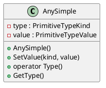

# AnySimple

## [IMPL-CLASSES-001] Description
The `AnySimple` class is a variant type that can hold any of the SMP primitive types. It provides type-safe access and conversion operators. It uses a union to store the value and an enum to track the current type.

## [IMPL-CLASSES-002] Methods
- `AnySimple()`: Default constructor (None type).
- `AnySimple(PrimitiveTypeKind kind)`: Constructor with type.
- `AnySimple(PrimitiveTypeKind kind, Type value)`: Template constructor.
- `SetValue(PrimitiveTypeKind kind, Type value)`: Sets the value and type.
- `operator Type() const`: Conversion operators for all primitive types.
- `MoveString()`: Moves the string ownership out of the AnySimple.
- `PrimitiveTypeKind GetType() const`: Returns the current type.
- `operator==`, `operator!=`: Comparison operators.

## [IMPL-CLASSES-003] Attributes
- `type`: `PrimitiveTypeKind` - The current type tag.
- `value`: `union PrimitiveTypeValue` - The union holding the actual value.

## [IMPL-CLASSES-004] Relations
- None.

## [IMPL-CLASSES-005] Dependencies
- `Smp/PrimitiveTypes.h`
- `Smp/InvalidAnyType.h`

## [IMPL-CLASSES-006] Tests
- `TestPublication.cpp`: Verifies usages of AnySimple for field values.

## [IMPL-CLASSES-007] Examples
- Storing an integer:
  ```cpp
  AnySimple val(PrimitiveTypeKind::PTK_Int32, 42);
  ```
- Reading a value:
  ```cpp
  Smp::Int32 i = (Smp::Int32)val;
  ```

## [IMPL-CLASSES-008] Class Diagram

