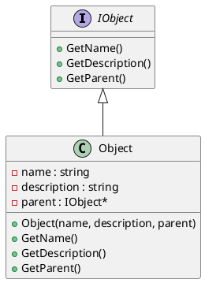

# Object

## [IMPL-CLASSES-001] Description
The `Object` class is the base implementation of the `IObject` interface. It provides the fundamental identity and hierarchy mechanisms for SMP objects, including name, description, and parent-child relationship.

## [IMPL-CLASSES-002] Methods
- `Object(String8 name, String8 description, IObject *parent)`: Constructor. Initializes name, description, and parent.
- `String8 GetName() const`: Returns the name of the object.
- `String8 GetDescription() const`: Returns the description of the object.
- `IObject *GetParent() const`: Returns the parent of the object.

## [IMPL-CLASSES-003] Attributes
- `name`: `std::string` - The name of the object.
- `description`: `std::string` - The description of the object.
- `parent`: `IObject*` - Pointer to the parent object.

## [IMPL-CLASSES-004] Relations
- Implements `IObject`.

## [IMPL-CLASSES-005] Dependencies
- `Smp/IObject.h`
- `string`

## [IMPL-CLASSES-006] Tests
- Implicitly tested in all other tests as most classes derive from it.

## [IMPL-CLASSES-007] Examples
- Creating an object:
  ```cpp
  class MyObject : public Object { ... };
  auto obj = new MyObject("Name", "Desc", parent);
  ```

## [IMPL-CLASSES-008] Class Diagram

