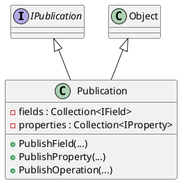

# Publication

## [IMPL-CLASSES-001] Description
The `Publication` class implements the `IPublication` interface. It handles the publication of fields, properties, and operations for a component. It stores these published features in collections.

## [IMPL-CLASSES-002] Methods
- `Publication(String8 name, String8 description, IObject *parent, ITypeRegistry *registry)`: Constructor.
- `PublishField(...)`: Overloads for publishing fields of different primitive types and custom types. Creates `SimpleField` instances.
- `PublishProperty(...)`: Publishes a property. Creates `Property` instance.
- `PublishOperation(...)`: Publishes an operation. Returns `IPublishOperation`.
- `GetField(String8 fullName)`: Retrieves a published field.
- `CreateRequest(String8 operationName)`: Creates a request for an operation.

## [IMPL-CLASSES-003] Attributes
- `registry`: `ITypeRegistry*` - Reference to the global type registry.
- `fields`: `Collection<IField>` - Collection of published fields.
- `properties`: `Collection<IProperty>` - Collection of published properties.
- `operations`: `Collection<IOperation>` - Collection of published operations.

## [IMPL-CLASSES-004] Relations
- Implements `IPublication`.
- Inherits `Object`.
- Creates `SimpleField`, `Property`, `Operation`, `Parameter`.

## [IMPL-CLASSES-005] Dependencies
- `Smp/IPublication.h`
- `Smp/Object.h`
- `Smp/SimpleField.h`

## [IMPL-CLASSES-006] Tests
- `PublicationTest.cpp`: Verifies publishing fields and accessing them.

## [IMPL-CLASSES-007] Examples
- Publishing a field:
  ```cpp
  publication->PublishField("MyField", "Desc", &myVar, ...);
  ```

## [IMPL-CLASSES-008] Class Diagram

