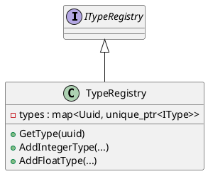

# TypeRegistry

## [IMPL-CLASSES-001] Description
The `TypeRegistry` class implements the `ITypeRegistry` interface. It manages the registration and retrieval of all types (primitive and user-defined) used in the simulation.

## [IMPL-CLASSES-002] Methods
- `TypeRegistry()`: Constructor. Registers all primitive types.
- `GetType(PrimitiveTypeKind)`: Retrieves a primitive type by kind.
- `GetType(Uuid)`: Retrieves a type by UUID.
- `AddFloatType(...)`: Registers a user-defined floating point type.
- `AddIntegerType(...)`: Registers a user-defined integer type.
- `AddEnumerationType(...)`: Registers a user-defined enumeration type.
- `AddArrayType(...)`: Registers a user-defined array type.
- `AddStringType(...)`: Registers a user-defined string type.
- `AddStructureType(...)`: Registers a user-defined structure type.
- `AddClassType(...)`: Registers a user-defined class type.

## [IMPL-CLASSES-003] Attributes
- `primitiveTypes`: `map<PrimitiveTypeKind, IType*>` - Storage for primitive types.
- `types`: `map<Uuid, unique_ptr<IType>>` - Storage for all types ownership.

## [IMPL-CLASSES-004] Relations
- Implements `ITypeRegistry`.
- Creates and owns `Type`, `IntegerType`, `FloatType`, `StringType`, `ArrayType`, `EnumerationType`, `StructureType`, `ClassType`.

## [IMPL-CLASSES-005] Dependencies
- `Smp/Publication/ITypeRegistry.h`
- `Smp/Publication/Type.h`

## [IMPL-CLASSES-006] Tests
- `PublicationTest.cpp`: Verifies registration and retrieval of types.

## [IMPL-CLASSES-007] Examples
- Registering a type:
  ```cpp
  registry->AddIntegerType("MyInt", "Desc", uuid, 0, 10, "unit");
  ```

## [IMPL-CLASSES-008] Class Diagram

