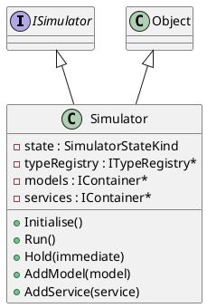

# Simulator

## [IMPL-CLASSES-001] Description
The `Simulator` class is the main entry point for the SMP simulation environment. It implements `ISimulator` and manages the lifecycle of the simulation (states), models, services, and factories. It acts as the root of the object hierarchy.

## [IMPL-CLASSES-002] Methods
- `Simulator(String8 name, String8 description, ITypeRegistry *typeRegistry)`: Constructor.
- `Initialise()`: Transitions to Initialising state and executes entry points.
- `Publish()`: Triggers publication (not fully implemented recursively yet).
- `Configure()`: Triggers configuration (not fully implemented recursively yet).
- `Connect()`: Transitions to Connecting and then Standby.
- `Run()`: Transitions to Executing.
- `Hold(Bool immediate)`: Transitions to Standby.
- `Store(String8 filename)`: transitions to Storing.
- `Restore(String8 filename)`: Transitions to Restoring.
- `Exit()`: Transitions to Exiting.
- `Abort()`: Transitions to Aborting.
- `GetState()`: Returns current state.
- `AddInitEntryPoint(IEntryPoint *entryPoint)`: Adds an entry point to be called during Initialise.
- `AddModel(IModel *model)`: Adds a model to the "Models" container.
- `AddService(IService *service)`: Adds a service to the "Services" container.
- `GetService(String8 name)`: Retrieves a service by name.
- `RegisterFactory(IFactory *componentFactory)`: Registers a factory.
- `CreateInstance(Uuid uuid, ...)`: Creates a component using a registered factory.
- `GetFactory(Uuid uuid)`: Retrieves a factory.
- `GetTypeRegistry()`: Returns the type registry.

## [IMPL-CLASSES-003] Attributes
- `state`: `SimulatorStateKind` - Current state.
- `typeRegistry`: `Publication::ITypeRegistry*` - Pointer to type registry.
- `containers`: `Collection<IContainer>` - Top level containers.
- `models`: `IContainer*` - "Models" container.
- `services`: `IContainer*` - "Services" container.
- `factories`: `Collection<IFactory>` - Registered factories.
- `initEntryPoints`: `vector<IEntryPoint*>` - List of initialization entry points.

## [IMPL-CLASSES-004] Relations
- Implements `ISimulator`.
- Inherits `Object`.
- Contains `IContainer`, `IFactory`, `IEntryPoint`.

## [IMPL-CLASSES-005] Dependencies
- `Smp/ISimulator.h`
- `Smp/Object.h`
- `Smp/Collection.h`

## [IMPL-CLASSES-006] Tests
- `SimulatorTest.cpp`: Verifies state transitions and container management.

## [IMPL-CLASSES-007] Examples
- Initialization:
  ```cpp
  auto sim = new Simulator("Sim", "Desc", registry);
  sim->AddModel(myModel);
  sim->Publish();
  sim->Configure();
  sim->Connect();
  ```

## [IMPL-CLASSES-008] Class Diagram

