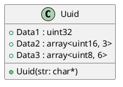

# Uuid

## [IMPL-CLASSES-001] Description
The `Uuid` class represents a Universally Unique Identifier. It provides constructors for various initialization methods (including string parsing) and comparison operators.

## [IMPL-CLASSES-002] Methods
- `Uuid()`: Default constructor (00000000-0000-0000-0000-000000000000).
- `Uuid(uint32_t, array, array)`: Constructor from parts.
- `Uuid(uint32_t, uint16_t, ...)`: Constructor from individual fields.
- `Uuid(const char *value)`: Constructor from string. Throws `UuidException` if invalid.
- `operator==`, `operator!=`, `operator<`: Comparison operators.

## [IMPL-CLASSES-003] Attributes
- `Data1`: `uint32_t`
- `Data2`: `std::array<uint16_t, 3>`
- `Data3`: `std::array<uint8_t, 6>`

## [IMPL-CLASSES-004] Relations
- None.

## [IMPL-CLASSES-005] Dependencies
- `Smp/Exception.h`

## [IMPL-CLASSES-006] Tests
- `StructureTest.cpp`: Verifies Uuid constants and comparison.

## [IMPL-CLASSES-007] Examples
- Creating from string:
  ```cpp
  Uuid id("12345678-1234-1234-1234-123456789012");
  ```

## [IMPL-CLASSES-008] Class Diagram

