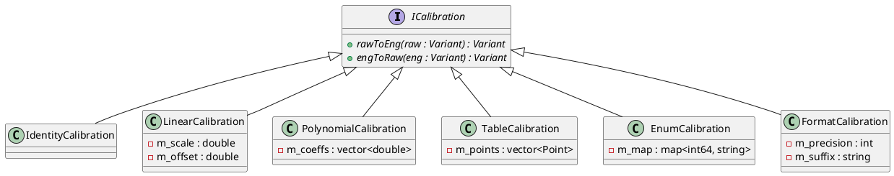

# Calibration Types

The `calibration` module provides several concrete implementations of the `ICalibration` interface for different types of data transformation.

## ICalibration Interface

### [IMPL-CLASSES-001] Description
The `ICalibration` interface defines the contract for bidirectional value transformation. It is used to convert raw hardware-level data (e.g., ADC counts) into meaningful engineering quantities (e.g., Celsius) and vice versa.

### [IMPL-CLASSES-002] Methods
- `rawToEng(raw)`: Transforms a raw input into an engineering value.
- `engToRaw(eng)`: Transforms an engineering value back into its raw representation.

---

## IdentityCalibration
Pass-through transformation where the engineering value is identical to the raw value. Useful as a default or for testing.

---

## LinearCalibration
Applies a linear transformation: `y = x * scale + offset`.
- **Constructor**: `LinearCalibration(scale, offset)`
- **Constraints**: `scale` cannot be zero.

---

## PolynomialCalibration
Applies a polynomial transformation: `y = a0 + a1*x + a2*x^2 + ...`.
- **Constructor**: `PolynomialCalibration(coeffs)` where `coeffs` is a vector `[a0, a1, a2, ...]`.
- **Note**: `engToRaw` is only supported for degree <= 1 (linear).

---

## TableCalibration (Point Pairs)
Performs linear interpolation based on a set of $(x, y)$ coordinate pairs.
- **Constructor**: `TableCalibration(points)`
- **Behavior**: Points are automatically sorted by $x$. Values outside the $x$ range are clamped to the endpoints.

---

## EnumCalibration
Maps discrete integer values to strings and vice versa.
- **Constructor**: `EnumCalibration(mapping)` where mapping is a `std::map<int64_t, std::string>`.
- **Use Case**: Mapping state codes (0, 1, 2) to descriptive names ("OFF", "ON", "ERROR").

---

## FormatCalibration
Converts numeric values to formatted strings with a specific precision and an optional unit suffix.
- **Constructor**: `FormatCalibration(precision, suffix)`
- **Example**: `FormatCalibration(2, "V")` converts `5.1234` to `"5.12 V"`.

---

## [IMPL-CLASSES-008] Class Diagram

