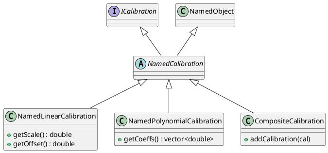

# Named Calibrations

The `NamedCalibration` classes integrate value transformations into the Quasar `NamedObject` hierarchy. This allows calibration parameters (like scale and offset) to be represented as child objects, enabling dynamic inspection and automatic serialization.

## NamedCalibration Base Class

### [IMPL-CLASSES-001] Description
The `NamedCalibration` class is the common base for all calibrations that participate in the Quasar tree. It inherits from `NamedObject` and implements `ICalibration`.

---

## NamedLinearCalibration
Wraps a `LinearCalibration` and stores its parameters as children.
- **Children**: `scale` (`NamedFloatingPoint<double>`), `offset` (`NamedFloatingPoint<double>`).
- **Behavior**: Retrieves parameter values from child objects before performing transformations.

---

## NamedPolynomialCalibration
Wraps a `PolynomialCalibration` and stores coefficients as children.
- **Children**: `a0`, `a1`, `a2`, ... (`NamedFloatingPoint<double>`).

---

## CompositeCalibration
Allows chaining multiple calibrations together.
- **Children**: Any number of `NamedCalibration` objects.
- **`rawToEng`**: Executes child calibrations in order.
- **`engToRaw`**: Executes child calibrations in reverse order.

---

## [IMPL-CLASSES-008] Class Diagram

