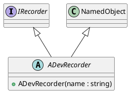

# ADevRecorder

## [IMPL-CLASSES-001] Description
The `ADevRecorder` class is an abstract base class that provides a common foundation for logging recorders integrated into the Quasar object hierarchy. It bridges the `IRecorder` functional interface with the `NamedObject` base class, allowing recorders to have a unique name, optional parentage, and visibility within the system's management tree.

## [IMPL-CLASSES-002] Methods
- `ADevRecorder(name)`: Constructor. Initializes the underlying `NamedObject` with the provided identifier.
- `~ADevRecorder()`: Virtual destructor.

## [IMPL-CLASSES-004] Relations
- Inherits from `quasar::named::NamedObject`.
- Implements `IRecorder`.
- Serves as the parent class for `CsvFileWriter`.

## [IMPL-CLASSES-005] Dependencies
- `quasar/named/NamedObject.hpp`
- `quasar/datalogger/IRecorder.hpp`

## [IMPL-CLASSES-008] Class Diagram

