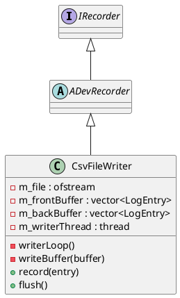

# CsvFileWriter

## [IMPL-CLASSES-001] Description
The `CsvFileWriter` class is a high-performance implementation of the `IRecorder` interface, designed to persist `LogEntry` data into CSV files. To minimize latency and avoid blocking the main logging pipeline during disk I/O, it utilizes a double-buffering strategy combined with a dedicated background writer thread. Log entries are pushed into a "front" buffer; once a threshold is reached or a flush is requested, the buffers are swapped, and the background thread writes the "back" buffer to the filesystem.

## [IMPL-CLASSES-002] Methods
- `CsvFileWriter(name, filePath)`: Constructor. Opens the target file and spawns the background writer thread.
- `~CsvFileWriter()`: Destructor. Signals the writer thread to stop and waits for all pending data to be written.
- `record(entry)`: Appends a `LogEntry` to the active front buffer. If the buffer is full, it signals the writer thread.
- `flush()`: Manually triggers a buffer swap and signals the background thread to write immediately.
- `writerLoop()`: Internal method running in the background thread. Waits for signals, swaps buffers, and calls `writeBuffer`.
- `writeBuffer(buffer)`: Internal helper that serializes a vector of `LogEntry` objects into the CSV file.
- `formatIso8601(tp)`: Utility to format timestamps according to the ISO-8601 standard.

## [IMPL-CLASSES-003] Attributes
- `m_filePath`: `std::string` - Destination path for the CSV file.
- `m_file`: `std::ofstream` - Handle to the open file.
- `m_frontBuffer`, `m_backBuffer`: `std::vector<LogEntry>` - The double buffers.
- `m_mutex`: `std::timed_mutex` - Protects buffer access and state flags.
- `m_cv`: `std::condition_variable_any` - Used to coordinate between the `record` calls and the background thread.
- `m_writerThread`: `std::thread` - The background execution context.
- `m_running`: `std::atomic<bool>` - Controls the writer loop lifecycle.

## [IMPL-CLASSES-004] Relations
- Inherits from `ADevRecorder` (which implements `IRecorder`).

## [IMPL-CLASSES-005] Dependencies
- `quasar/datalogger/ADevRecorder.hpp`
- `quasar/datalogger/LogEntry.hpp`
- `fstream`, `thread`, `mutex`, `condition_variable`.

## [IMPL-CLASSES-006] Tests
- `TestCsvFileWriter.cpp`: Verifies file creation, correct formatting of different payload types, and data integrity after flush.

## [IMPL-CLASSES-007] Examples
- Direct instantiation:
  ```cpp
  auto writer = std::make_shared<CsvFileWriter>("SystemLog", "output.csv");
  LogEntry entry = ...;
  writer->record(entry);
  writer->flush();
  ```

## [IMPL-CLASSES-008] Class Diagram

