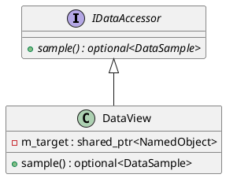

# Data Access and Views

The `datalogger` module provides a flexible mechanism for sampling data from the Quasar system via the `IDataAccessor` interface.

## IDataAccessor

### [IMPL-CLASSES-001] Description
The `IDataAccessor` interface defines the contract for any component capable of retrieving a discrete data point from the system state. It serves as the bridge between the application's active objects and the logging system's periodic sampling routines.

### [IMPL-CLASSES-002] Methods
- `sample()`: Pure virtual method. Retrieves the current state of the target data source and returns it as a `DataSample` (wrapped in an `std::optional`).

---

## DataView

### [IMPL-CLASSES-001] Description
The `DataView` class is a concrete implementation of `IDataAccessor` that wraps a `NamedObject`. It provides a standardized way to sample the value of any object in the Quasar tree, including numeric types, booleans, and strings.

### [IMPL-CLASSES-002] Methods
- `DataView(target)`: Constructor. Takes a shared pointer to the `NamedObject` to be monitored.
- `sample()`: Implementation of the sampling logic. It inspects the type of the wrapped `NamedObject` and extracts its current value into a `DataSample`.

### [IMPL-CLASSES-003] Attributes
- `m_target`: `std::shared_ptr<quasar::named::NamedObject>` - The object being monitored.

### [IMPL-CLASSES-004] Relations
- Implements `IDataAccessor`.
- Holds a reference to a `quasar::named::NamedObject`.

### [IMPL-CLASSES-008] Class Diagram

