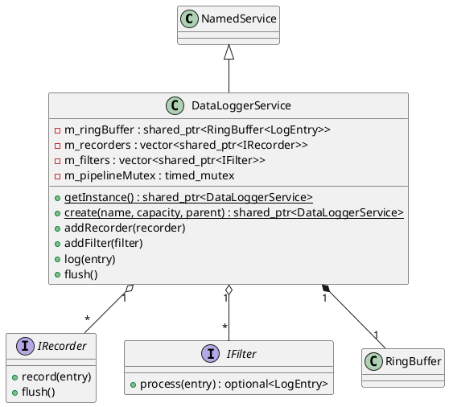

# DataLoggerService

## [IMPL-CLASSES-001] Description
The `DataLoggerService` class is the central orchestrator of the data logging and acquisition system. It implements the `NamedService` interface, allowing it to run as an autonomous background service within the Quasar hierarchy. Its primary responsibility is to manage a high-performance logging pipeline: it pulls `LogEntry` objects from a thread-safe `RingBuffer`, applies a chain of `IFilter` objects for real-time transformation or drop logic, and finally dispatches the processed entries to one or more `IRecorder` backends (e.g., CSV files).

It supports a singleton pattern via `getInstance()` for easy global access, but can also be instantiated multiple times for isolated logging domains.

## [IMPL-CLASSES-002] Methods
- `create(name, ringBufferCapacity, parent)`: Static factory method. Registers a "run" `NamedMethod` that calls `processRingBuffer`.
- `getInstance()`: Returns the global singleton instance, initializing it with default settings if necessary.
- `initDefault(filePath, capacity)`: Explicitly initializes the singleton instance with custom configuration.
- `resetInstance()`: Stops and destroys the singleton instance (used for clean shutdown or testing).
- `DataLoggerService(name, ringBufferCapacity)`: Constructor. Initializes the internal `RingBuffer`.
- `~DataLoggerService()`: Destructor.
- `addRecorder(recorder)`: Adds a storage backend to the pipeline. Protected by `m_pipelineMutex`.
- `addFilter(filter)`: Adds a processing filter to the pipeline. Protected by `m_pipelineMutex`.
- `log(entry)`: Asynchronously pushes a `LogEntry` into the `RingBuffer`. Non-blocking.
- `logEvent(level, message)`: Convenience method to log a text-based event with a specific severity.
- `flush()`: Manually triggers processing of the current ring buffer content and signals all recorders to persist pending data.
- `getType()`: Returns "DataLoggerService".
- `processRingBuffer(owner, args)`: The internal processing loop (called by the background thread). Pops entries, filters them, and records them.

## [IMPL-CLASSES-003] Attributes
- `m_ringBuffer`: `std::shared_ptr<RingBuffer<LogEntry>>` - High-performance queue for incoming logs.
- `m_pipelineMutex`: `std::timed_mutex` - Ensures thread-safe modification of filters and recorders.
- `m_recorders`: `std::vector<std::shared_ptr<IRecorder>>` - List of active storage backends.
- `m_filters`: `std::vector<std::shared_ptr<IFilter>>` - Chain of processing filters.

## [IMPL-CLASSES-004] Relations
- Inherits from `quasar::named::NamedService`.
- Owns a `RingBuffer<LogEntry>`.
- Aggregates multiple `IFilter` and `IRecorder` instances.

## [IMPL-CLASSES-005] Dependencies
- `quasar/named/NamedService.hpp`
- `quasar/named/NamedMethod.hpp`
- `quasar/datalogger/RingBuffer.hpp`
- `quasar/datalogger/LogEntry.hpp`
- `quasar/datalogger/IRecorder.hpp`
- `quasar/datalogger/IFilter.hpp`

## [IMPL-CLASSES-006] Tests
- `TestDataLoggerService.cpp`: Verifies singleton lifecycle, pipeline processing, and basic log routing.
- `TestDataloggerStress.cpp`: Validates performance under high concurrent load.

## [IMPL-CLASSES-007] Examples
- Basic usage via singleton:
  ```cpp
  auto logger = DataLoggerService::getInstance();
  logger->logEvent(LogLevel::Info, "System started");
  ```
- Adding a custom recorder:
  ```cpp
  auto mySvc = DataLoggerService::create("MyLogger", 4096);
  mySvc->addRecorder(std::make_shared<CsvFileWriter>("Output", "data.csv"));
  mySvc->start();
  ```

## [IMPL-CLASSES-008] Class Diagram

