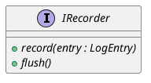
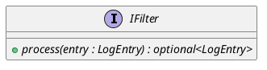

# Datalogger Interfaces

The `datalogger` module relies on two primary abstract interfaces to provide extensibility and modularity: `IRecorder` for output backends and `IFilter` for real-time processing.

## IRecorder

### [IMPL-CLASSES-001] Description
The `IRecorder` interface defines the contract for any component capable of persisting or transmitting `LogEntry` data. Implementation examples include file writers, database adapters, or network stream publishers.

### [IMPL-CLASSES-002] Methods
- `record(entry)`: Pure virtual method. Consumes a `LogEntry`. This call is usually made from the `DataLoggerService` background thread.
- `flush()`: Pure virtual method. Instructs the recorder to ensure all currently buffered data is fully persisted to the underlying storage.

### [IMPL-CLASSES-008] Class Diagram

---

## IFilter

### [IMPL-CLASSES-001] Description
The `IFilter` interface defines the contract for pluggable processing units within the logging pipeline. Filters can be used to perform unit conversion, data compression, range checking, or conditional suppression of entries.

### [IMPL-CLASSES-002] Methods
- `process(entry)`: Pure virtual method. Takes an input `LogEntry` and returns an `std::optional<LogEntry>`.
    - Returning a value: The entry (possibly modified) continues through the pipeline.
    - Returning `std::nullopt`: The entry is "dropped" and will not reach subsequent filters or any recorders.

### [IMPL-CLASSES-008] Class Diagram

