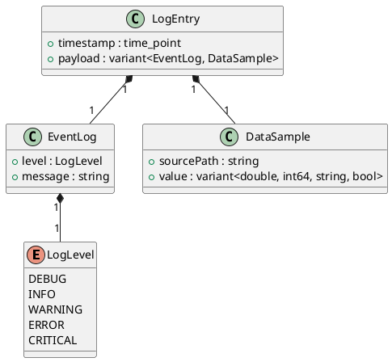

# LogEntry

## [IMPL-CLASSES-001] Description
The `LogEntry` structure is the fundamental unit of information within the data logging system. It is designed to be a lightweight, unified container that can represent two distinct types of logging activities:
1. **Events**: High-level system messages with a severity level (`LogLevel`) and a text description.
2. **Data Samples**: Raw or processed numeric and boolean values captured from specific system components, identified by their `sourcePath`.

Each entry is automatically timestamped at the point of creation, ensuring temporal accuracy across the logging pipeline.

## [IMPL-CLASSES-002] Methods
- Being a plain-old-data (POD) structure, it does not define specific methods beyond standard compiler-generated ones.

## [IMPL-CLASSES-003] Attributes
- `timestamp`: `time_point` - Absolute time when the entry was generated.
- `payload`: `std::variant<EventLog, DataSample>` - The actual content of the log.
    - **EventLog**: Contains `level` (`LogLevel`) and `message` (`std::string`).
    - **DataSample**: Contains `sourcePath` (`std::string`) and `value` (`variant<double, int64_t, string, bool>`).

## [IMPL-CLASSES-004] Relations
- Used as the element type for `RingBuffer`.
- Passed through `IFilter` and `IRecorder` interfaces.

## [IMPL-CLASSES-005] Dependencies
- `chrono`, `string`, `variant`, `cstdint`.

## [IMPL-CLASSES-006] Tests
- `TestLogMacros.cpp`: Verifies that logging macros correctly populate `LogEntry` attributes.

## [IMPL-CLASSES-007] Examples
- Creating an event log:
  ```cpp
  LogEntry entry;
  entry.timestamp = std::chrono::system_clock::now();
  entry.payload = EventLog{LogLevel::INFO, "Initialized"};
  ```
- Creating a data sample:
  ```cpp
  LogEntry entry;
  entry.payload = DataSample{"/devices/adc0/v_out", 12.5};
  ```

## [IMPL-CLASSES-008] Class Diagram

