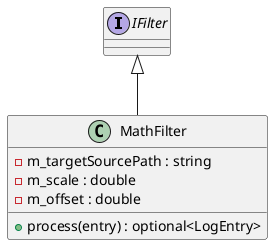

# MathFilter

## [IMPL-CLASSES-001] Description
The `MathFilter` class is a concrete implementation of the `IFilter` interface. It provides basic linear transformation capabilities for numeric data samples. When a `LogEntry` containing a `DataSample` with a matching `sourcePath` passes through this filter, its value is scaled and shifted according to the configured parameters. Non-matching entries or non-numeric samples are passed through without modification.

The transformation formula is: `output = (input * scale) + offset`.

## [IMPL-CLASSES-002] Methods
- `MathFilter(targetSourcePath, scale, offset)`: Constructor. Sets the filtering criteria and transformation constants.
- `process(entry)`: Implementation of the filter logic. If the entry is a numeric `DataSample` matching `targetSourcePath`, it applies the math formula and returns the updated entry. Otherwise, returns the original entry.

## [IMPL-CLASSES-003] Attributes
- `m_targetSourcePath`: `std::string` - The specific data source to which the transformation should be applied.
- `m_scale`: `double` - Multiplier for the input value.
- `m_offset`: `double` - Constant added after scaling.

## [IMPL-CLASSES-004] Relations
- Implements `IFilter`.

## [IMPL-CLASSES-005] Dependencies
- `quasar/datalogger/IFilter.hpp`
- `quasar/datalogger/LogEntry.hpp`

## [IMPL-CLASSES-007] Examples
- Converting ADC counts to Volts:
  ```cpp
  // Assume 12-bit ADC (0-4095) for 0-5V range
  auto voltFilter = std::make_shared<MathFilter>("/hw/adc0", 5.0 / 4095.0, 0.0);
  service->addFilter(voltFilter);
  ```

## [IMPL-CLASSES-008] Class Diagram

