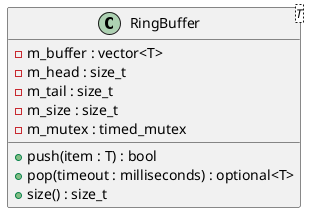

# RingBuffer<T>

## [IMPL-CLASSES-001] Description
The `RingBuffer` is a template class providing a thread-safe, fixed-capacity circular queue designed for high-throughput data transfer between threads. In the Quasar logging system, it serves as the primary ingestion point for log entries, decoupling the producers (the application code) from the consumer (the `DataLoggerService` background loop). 

Key features:
- **Lock-Free-Like Producers**: Attempts to push data with a short timeout (10ms) to ensure that the main application loops are never indefinitely stalled by logging activity.
- **Overwriting Behavior**: When the buffer reaches its maximum capacity, new entries overwrite the oldest ones to maintain data freshness and prevent memory exhaustion.
- **Bounded Waiting**: Complies with `CS-0010` mandates by using `std::timed_mutex` instead of standard mutexes.
- **Move Semantics**: Optimized for performance by using `std::move` to transfer ownership of complex payloads.

## [IMPL-CLASSES-002] Methods
- `RingBuffer(capacity)`: Constructor. Allocates the internal vector storage. Throws `std::invalid_argument` if capacity is 0.
- `push(item)`: Overloaded for `const T&` and `T&&`. Attempts to append an item. Returns `true` on success, `false` if the mutex could not be acquired within 10ms. If full, it increments the head to overwrite the oldest entry.
- `pop(timeout)`: Removes and returns the oldest item. If the buffer is empty, it waits up to the specified `timeout`. Returns `std::optional<T>`.
- `size()`: Returns the current number of items in the buffer (thread-safe, with 10ms timeout).
- `capacity()`: Returns the fixed capacity of the buffer.

## [IMPL-CLASSES-003] Attributes
- `m_capacity`: `size_t` - Maximum number of elements.
- `m_buffer`: `std::vector<T>` - Pre-allocated storage.
- `m_head`: `size_t` - Index of the oldest item (read pointer).
- `m_tail`: `size_t` - Index where the next item will be written (write pointer).
- `m_size`: `size_t` - Current occupancy count.
- `m_mutex`: `mutable std::timed_mutex` - Protects internal state.
- `m_cv`: `std::condition_variable_any` - Used for blocking `pop` operations.

## [IMPL-CLASSES-004] Relations
- Used by `DataLoggerService` to queue `LogEntry` objects.

## [IMPL-CLASSES-005] Dependencies
- `vector`, `mutex`, `condition_variable`, `chrono`, `optional`.

## [IMPL-CLASSES-006] Tests
- `TestDataloggerRingBuffer.cpp`: Verifies basic FIFO logic, wrap-around/overwriting behavior, and multithreaded producer-consumer integrity.

## [IMPL-CLASSES-007] Examples
- Manual usage:
  ```cpp
  RingBuffer<int> rb(10);
  rb.push(42);
  auto val = rb.pop(std::chrono::milliseconds(100));
  ```

## [IMPL-CLASSES-008] Class Diagram

