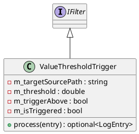

# ValueThresholdTrigger

## [IMPL-CLASSES-001] Description
The `ValueThresholdTrigger` class is a conditional `IFilter` that acts as a gate for the logging pipeline. It monitors a specific numeric data source (identified by `targetSourcePath`) and toggles its active state based on whether the data value crosses a defined threshold. While the trigger is inactive, all subsequent entries in the pipeline are dropped. Once the condition is met, the gate "opens," and entries are allowed through until the condition is no longer satisfied.

This is primarily used to implement "burst logging" or "event-triggered acquisition," where storage is only consumed when system variables reach critical levels.

## [IMPL-CLASSES-002] Methods
- `ValueThresholdTrigger(targetSourcePath, threshold, triggerAbove)`: Constructor. Configures the source to monitor and the activation direction.
- `process(entry)`: Implementation of the gating logic. 
    1. If the entry is a numeric `DataSample` matching `targetSourcePath`, it evaluates the condition and updates the internal `m_isTriggered` state.
    2. If the internal state is active, the entry is returned (allowed).
    3. If the internal state is inactive, `std::nullopt` is returned (dropped).

## [IMPL-CLASSES-003] Attributes
- `m_targetSourcePath`: `std::string` - The data source used to control the gate.
- `m_threshold`: `double` - The numeric value used for comparison.
- `m_triggerAbove`: `bool` - If `true`, the trigger is active when `value > threshold`. If `false`, active when `value < threshold`.
- `m_isTriggered`: `bool` - Current state of the gate.

## [IMPL-CLASSES-004] Relations
- Implements `IFilter`.

## [IMPL-CLASSES-005] Dependencies
- `quasar/datalogger/IFilter.hpp`
- `quasar/datalogger/LogEntry.hpp`

## [IMPL-CLASSES-007] Examples
- Logging only when temperature exceeds 100°C:
  ```cpp
  auto safetyTrigger = std::make_shared<ValueThresholdTrigger>("/sensors/temp", 100.0, true);
  service->addFilter(safetyTrigger);
  ```

## [IMPL-CLASSES-008] Class Diagram

