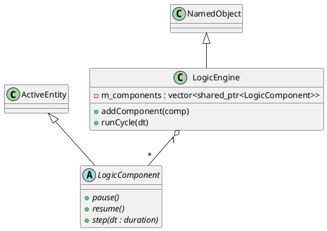

# LogicEngine and LogicComponent

The `logicengine` module provides a framework for orchestrating various types of logical controllers, such as State Machines, SFCs, and Cause-Effect matrices.

## LogicComponent

### [IMPL-CLASSES-001] Description
The `LogicComponent` class is the abstract base for all operational logic entities. It inherits from `ActiveEntity`, integrating logic execution into the Quasar lifecycle management. 

### [IMPL-CLASSES-002] Methods
- `pause()`, `resume()`: Pure virtual methods to control the activation state of the logic.
- `step(dt)`: Pure virtual method representing a single atomic execution cycle. `dt` provides the elapsed time for temporal logic (e.g., timers in SFC).

---

## LogicEngine

### [IMPL-CLASSES-001] Description
The `LogicEngine` class is the high-level container and orchestrator. It manages a collection of `LogicComponent` objects and provides a centralized way to trigger their execution cycles.

### [IMPL-CLASSES-002] Methods
- `create(name, parent)`: Static factory method.
- `addComponent(component)`: Registers a logic component for orchestration.
- `runCycle(dt)`: Iterates through all registered components and calls their `step(dt)` method. This method ensures thread-safe access to the component list.

### [IMPL-CLASSES-003] Attributes
- `m_components`: `std::vector<std::shared_ptr<LogicComponent>>` - The list of managed logical entities.
- `m_engineMutex`: `std::recursive_timed_mutex` - Protects the component list from concurrent modification during execution.

### [IMPL-CLASSES-004] Relations
- `LogicEngine` owns and orchestrates multiple `LogicComponent` instances.
- `LogicComponent` inherits from `quasar::named::ActiveEntity`.

### [IMPL-CLASSES-008] Class Diagram

