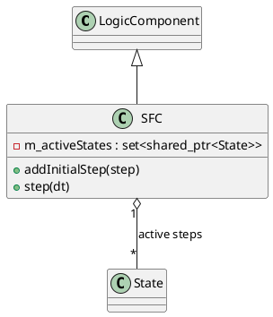

# SFC (Sequential Function Chart)

## [IMPL-CLASSES-001] Description
The `SFC` class is a `LogicComponent` that implements the Sequential Function Chart (also known as Grafcet) execution model. Unlike the `StateMachine` which has a single active state, an `SFC` supports multi-token execution, allowing multiple "steps" (represented by `State` objects) to be active simultaneously. It follows a transactional cycle where all enabled transitions are evaluated, and tokens are moved from source steps to target steps in a single atomic operation.

## [IMPL-CLASSES-002] Methods
- `create(name, parent)`: Static factory method.
- `step(dt)`: Executes a cycle. It evaluates the invariants of all active steps, checks their outgoing transitions, and updates the set of active steps accordingly.
- `addInitialStep(step)`: Configures a step that should be active when the SFC starts.
- `setContextRoot(root)`: Defines the evaluation context for transition guards and state invariants.
- `getActiveStates()`: Returns the set of currently active steps.

## [IMPL-CLASSES-003] Attributes
- `m_activeStates`: `std::set<std::shared_ptr<State>>` - The collection of currently active tokens in the chart.
- `m_contextRoot`: `std::shared_ptr<quasar::named::NamedObject>` - Root for variable resolution.

## [IMPL-CLASSES-004] Relations
- Inherits from `LogicComponent`.
- Manages multiple `State` instances as active steps.

## [IMPL-CLASSES-008] Class Diagram

