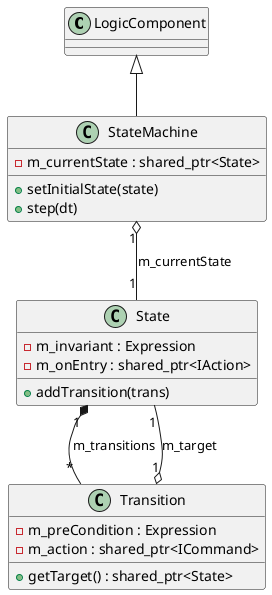

# StateMachine, State and Transition

The `logicengine` module implements a robust Hierarchical State Machine (HSM) framework with transactional guarantees.

## StateMachine

### [IMPL-CLASSES-001] Description
The `StateMachine` class is a `LogicComponent` that executes a hierarchical state machine. It manages the current active state and coordinates the evaluation of invariants and transitions during each execution cycle (`step`). It supports "ground" states for initialization and "context roots" for variable lookup in expressions.

### [IMPL-CLASSES-002] Methods
- `create(name, parent)`: Static factory method.
- `step(dt)`: Main execution cycle. Checks the current state's invariant, and then evaluates outgoing transitions.
- `setInitialState(state)`: Configures the starting state.
- `setContextRoot(root)`: Defines the `NamedObject` tree used as the evaluation context for Lua-based expressions (`ctx` variable).

---

## State

### [IMPL-CLASSES-001] Description
The `State` class represents a discrete condition or mode within a state machine. It can have hierarchical children (nested states) and defines behavioral hooks.

### [IMPL-CLASSES-002] Methods
- `setInvariant(expr)`: Defines a condition that must remain true while the state is active. If it fails, the machine transitions to the `failureState`.
- `setOnEntry(action)`, `setOnExit(action)`, `setOnDo(action)`: Sets executable hooks for state lifecycle events.
- `addTransition(transition)`: Registers an outgoing path to another state.

---

## Transition

### [IMPL-CLASSES-001] Description
The `Transition` class defines a transactional path between two states. It includes "guards" (pre-conditions) and executable effects.

### [IMPL-CLASSES-002] Methods
- `setPreCondition(expr)`: The "guard" expression. The transition only fires if this evaluates to true.
- `setAction(command)`: The effect executed during the transition.
- `setPostCondition(expr)`: An optional check performed after the transition completes.

---

## [IMPL-CLASSES-008] Class Diagram

