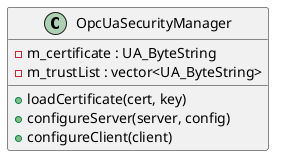

# OpcUaSecurityManager

## [IMPL-CLASSES-001] Description
The `OpcUaSecurityManager` class encapsulates the logic for handling X.509 certificates and configuring security policies for both OPC UA servers and clients. It provides utilities for loading cryptographic identities (DER format), managing trust lists for peer validation, and applying these settings to the underlying `open62541` stack.

## [IMPL-CLASSES-002] Methods
- `loadCertificate(certPath, keyPath)`: Loads the local identity from files on disk.
- `loadTrustList(paths)`: Populates the list of certificates trusted by this entity.
- `configureServer(server, config)`: Sets up the server with loaded security settings, including encryption policies (`Basic256Sha256`, etc.).
- `configureClient(client)`: Sets up the client for secure connection to a server.
- `generateSelfSigned(...)`: Utility to bootstrap security by creating a new self-signed identity.

## [IMPL-CLASSES-003] Attributes
- `m_certificate`, `m_privateKey`: `UA_ByteString` - The local identity buffers.
- `m_trustList`: `std::vector<UA_ByteString>` - Collection of trusted peer certificates.

## [IMPL-CLASSES-004] Relations
- Used by `OpcUaServerService` and `OpcUaClientService`.

## [IMPL-CLASSES-008] Class Diagram

