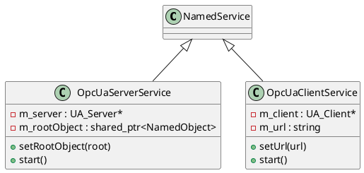

# OPC UA Services

The `opcua` module provides high-level `NamedService` implementations for creating OPC UA servers and clients, integrated with the Quasar `NamedObject` hierarchy.

## OpcUaServerService

### [IMPL-CLASSES-001] Description
The `OpcUaServerService` class allows exposing a `NamedObject` tree as an OPC UA address space. It automatically maps Quasar objects to OPC UA Variable nodes and Quasar `NamedMethod` objects to OPC UA Method nodes. It supports real-time synchronization, updating the OPC UA nodes whenever the underlying Quasar objects change.

### [IMPL-CLASSES-002] Methods
- `create(name, parent)`: Static factory method.
- `setPort(port)`: Configures the TCP listening port (default: 4840).
- `setRootObject(root)`: Sets the branch of the Quasar tree to be exposed.
- `loadCertificate(certPath, keyPath)`: Configures the X.509 identity for the server.
- `addUser(username, password)`: Enables credential-based authentication.
- `mapObject(obj, parentNodeId)`: Internal recursive method that builds the OPC UA node structure.

---

## OpcUaClientService

### [IMPL-CLASSES-001] Description
The `OpcUaClientService` class acts as a bridge to a remote OPC UA server. It browses the remote address space and creates a local "mirrored" tree of `NamedObject` instances. It uses OPC UA subscriptions to receive real-time notifications from the server and updates the local objects accordingly. Method calls on local objects are forwarded to the remote server.

### [IMPL-CLASSES-002] Methods
- `create(name, parent)`: Static factory method.
- `setUrl(url)`: Configures the remote server endpoint.
- `setCredentials(username, password)`: Configures login information.
- `enqueueTask(task)`: Thread-safe mechanism to execute `open62541` client calls from other threads.
- `browseAndMirror(remoteNodeId, localParent)`: Internal recursive method that populates the local tree.

---

## [IMPL-CLASSES-008] Class Diagram

