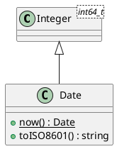

# Date

## [IMPL-CLASSES-001] Description
The `Date` class represents a calendar day, stored as a 64-bit integer count of days since the Unix epoch (January 1st, 1970). 

It inherits from `Integer<int64_t>`, providing standard arithmetic and comparison operations. It includes utility methods for retrieving the current date from the system clock and formatting the date into an ISO-8601 string (`YYYY-MM-DD`).

## [IMPL-CLASSES-002] Methods
- `Date(days)`: Constructor.
- `now()`: Static factory method. Returns a `Date` representing the current day in UTC.
- `toISO8601()`: Returns a standardized string representation (e.g., `"2026-04-09"`).

## [IMPL-CLASSES-004] Relations
- Inherits from `Integer<int64_t>`.

## [IMPL-CLASSES-008] Class Diagram

