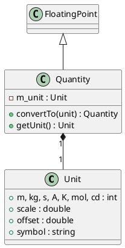

# Quantity and Unit

The `coretypes` module provides a lightweight physical modeling system based on SI units and dimensional analysis.

## Unit

### [IMPL-CLASSES-001] Description
The `Unit` struct represents a physical unit of measure. It stores the exponents for the seven SI base dimensions (length, mass, time, electric current, temperature, amount of substance, and luminous intensity) along with a scaling factor and offset for conversions (e.g., Celsius to Kelvin).

It supports dimensional arithmetic: multiplying or dividing two units correctly combines their dimension exponents and scaling factors.

### [IMPL-CLASSES-002] Methods
- `hasSameDimensions(other)`: Returns true if two units are compatible for addition or direct conversion.
- `operator*`, `operator/`: Dimensional arithmetic.

---

## Quantity

### [IMPL-CLASSES-001] Description
The `Quantity` class represents a physical value paired with a `Unit`. It inherits from `FloatingPoint<double>`, providing numeric operations while enforcing dimensional safety. 

### [IMPL-CLASSES-002] Methods
- `Quantity(value, unit)`: Constructor.
- `convertTo(targetUnit)`: Returns a new `Quantity` in the target unit. Throws if dimensions are incompatible.
- `operator+`, `operator*`: Type-safe physical arithmetic. Addition requires identical dimensions; multiplication generates a new unit.
- `getUnit()`: Returns the associated unit.

### [IMPL-CLASSES-008] Class Diagram

