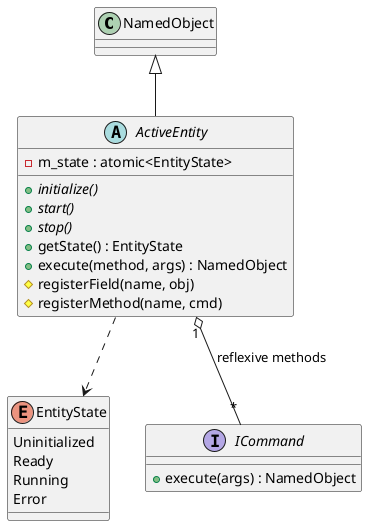

# ActiveEntity

## [IMPL-CLASSES-001] Description
The `ActiveEntity` class is an abstract base class that extends `NamedObject` to provide a standardized framework for operational components. It introduces formal lifecycle management, reflexivity for both fields and methods, and integrated observer/producer patterns. 

It is designed to represent complex entities like hardware devices, communication protocols, and background services. By registering its internal members as reflexive fields or methods, an `ActiveEntity` makes its capabilities discoverable and interactable at runtime through generic interfaces (e.g., Web UI, Scripting, or OPC UA).

## [IMPL-CLASSES-002] Methods
- `initialize()`, `start()`, `stop()`, `reset()`: Pure virtual lifecycle hooks.
- `getState()`: Returns the current `EntityState` (Uninitialized, Ready, Running, Error).
- `getField(name)`: Retrieves a child `NamedObject` registered as a reflexive field.
- `execute(methodName, args)`: Dynamically invokes a registered command with a `NamedObject` parameter tree.
- `listFields()`, `listMethods()`: Introspection utilities.
- `registerField(name, field)`: Protected method to expose a member variable via reflexivity.
- `registerMethod(name, command)`: Protected method to expose functionality via reflexivity.

## [IMPL-CLASSES-003] Attributes
- `m_state`: `std::atomic<EntityState>` - Thread-safe lifecycle state tracker.
- `m_fields`: `std::unordered_map<string, weak_ptr<NamedObject>>` - Registry of reflexive state variables.
- `m_methods`: `std::unordered_map<string, shared_ptr<ICommand>>` - Registry of executable capabilities.

## [IMPL-CLASSES-004] Relations
- Inherits from `NamedObject`.
- Uses `ICommand` for reflexive method implementation.
- Uses `IObserver` for event notifications.

## [IMPL-CLASSES-008] Class Diagram

