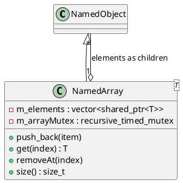

# NamedArray<T>

## [IMPL-CLASSES-001] Description
The `NamedArray` class is a template-based `NamedObject` that manages an ordered collection of elements of type `T` (where `T` must derive from `NamedObject`). It bridges standard array-like behavior with the Quasar tree structure: elements are added to the internal `std::vector` and simultaneously attached as hierarchical children. 

To maintain consistency within the tree, `NamedArray` automatically renames its children according to their index (e.g., "_0", "_1", "_2"). If an element is removed from the middle of the array, all subsequent children are renamed to ensure a contiguous index sequence.

## [IMPL-CLASSES-002] Methods
- `create(name, parent)`: Static factory method.
- `get(index)`: Thread-safe access to an element. Throws `std::out_of_range`.
- `push_back(item)`: Appends an item, renames it to the next index, and adds it as a child.
- `removeAt(index)`: Removes an item and renames subsequent items to maintain index integrity.
- `size()`: Returns the number of elements.
- `begin()`, `end()`: Provides iterators for STL-style traversal.
- `addChild(child)`, `removeChild(name)`: Overridden internal helpers to keep the vector and the child list synchronized.

## [IMPL-CLASSES-003] Attributes
- `m_elements`: `std::vector<shared_ptr<T>>` - The ordered collection of items.
- `m_arrayMutex`: `std::recursive_timed_mutex` - Ensures thread-safe operations on the collection.

## [IMPL-CLASSES-004] Relations
- Inherits from `NamedObject`.
- Contains multiple objects of type `T` (deriving from `NamedObject`).

## [IMPL-CLASSES-008] Class Diagram

