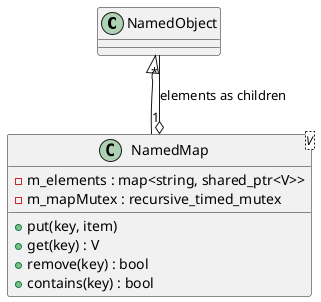

# NamedMap<V>

## [IMPL-CLASSES-001] Description
The `NamedMap` class is a template-based `NamedObject` that implements a hierarchical key-value dictionary. It allows storing a collection of objects of type `V` (where `V` must derive from `NamedObject`), where each object is identified by a unique string key. 

In the Quasar tree, the keys used in the map directly correspond to the names of the child objects. `NamedMap` ensures that its internal `std::map` and its hierarchical child list are kept perfectly synchronized. Adding or replacing an item in the map automatically updates the tree topology.

## [IMPL-CLASSES-002] Methods
- `create(name, parent)`: Static factory method.
- `put(key, item)`: Inserts or replaces an element. The item is renamed to the provided key and attached as a child.
- `get(key)`: Thread-safe retrieval of an item. Throws `std::out_of_range` if the key is missing.
- `contains(key)`: Checks if a specific key is registered in the map.
- `remove(key)`: Deletes an entry from both the internal map and the hierarchical child list.
- `size()`: Returns the number of entries.
- `begin()`, `end()`: Provides iterators for map-style traversal.

## [IMPL-CLASSES-003] Attributes
- `m_elements`: `std::map<string, shared_ptr<V>>` - The internal key-value storage.
- `m_mapMutex`: `std::recursive_timed_mutex` - Ensures thread-safe access to the collection.

## [IMPL-CLASSES-004] Relations
- Inherits from `NamedObject`.
- Contains multiple objects of type `V` (deriving from `NamedObject`).

## [IMPL-CLASSES-008] Class Diagram

