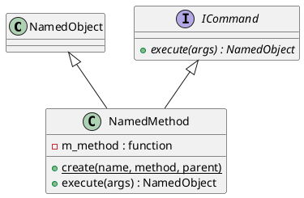

# NamedMethod

## [IMPL-CLASSES-001] Description
The `NamedMethod` class represents executable logic as a node within the `NamedObject` hierarchy. This "behavior-as-data" approach allows system capabilities to be discovered, introspected, and triggered using the same tree-based mechanisms used for state variables. 

Each `NamedMethod` wraps a C++ lambda or function that consumes a `NamedObject` parameter tree and returns a `NamedObject` result tree. The execution context is provided with a reference to the "owner" (the parent of the method), enabling the method logic to interact with sibling state variables or other child methods.

## [IMPL-CLASSES-002] Methods
- `create(name, method, parent)`: Static factory method.
- `execute(args)`: Implementation of the `ICommand` interface. Invokes the underlying logic. The `args` tree is passed along with the parent object to the method implementation.
- `getType()`: Returns "NamedMethod".
- `clone(policy)`: Creates a new `NamedMethod` with the same logic but a detached hierarchy.

## [IMPL-CLASSES-003] Attributes
- `m_method`: `MethodType` - The functional object containing the executable code.

## [IMPL-CLASSES-004] Relations
- Inherits from `NamedObject`.
- Implements `ICommand`.
- Often contained within `ActiveEntity` or `NamedService`.

## [IMPL-CLASSES-008] Class Diagram

