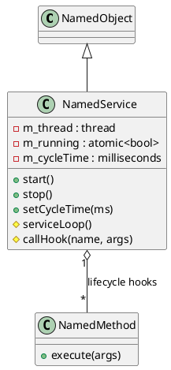

# NamedService

## [IMPL-CLASSES-001] Description
The `NamedService` class is a specialized `NamedObject` that provides an autonomous execution context. It manages a background thread that can perform periodic or event-driven tasks. 

A unique feature of `NamedService` is its "behavior-driven" architecture: it automatically searches for children of type `NamedMethod` with specific names to use as lifecycle hooks:
- **"configure"**: Executed once during the `start()` sequence.
- **"onStart"**: Executed immediately before spawning the thread.
- **"run"**: Executed cyclically within the thread loop.
- **"onStop"**: Executed after the loop terminates.

This allows defining the behavior of a service entirely through its child nodes, which is particularly powerful when combined with `NamedLuaMethod` or remote discovery interfaces.

## [IMPL-CLASSES-002] Methods
- `create(name, parent)`: Static factory method.
- `start()`: Triggers the initialization sequence and spawns the worker thread.
- `stop()`: Signals the thread to terminate and waits for completion.
- `isRunning()`: Thread-safe check of the service state.
- `setCycleTime(ms)`: Configures the sleep interval between "run" iterations.
- `callHook(methodName, args)`: Internal helper that finds and executes a child `NamedMethod`.

## [IMPL-CLASSES-003] Attributes
- `m_thread`: `std::thread` - The private execution context.
- `m_running`: `std::atomic<bool>` - Master control flag for the thread.
- `m_cycleTime`: `std::chrono::milliseconds` - The loop frequency.

## [IMPL-CLASSES-004] Relations
- Inherits from `NamedObject`.
- Orchestrates child `NamedMethod` objects.

## [IMPL-CLASSES-008] Class Diagram

