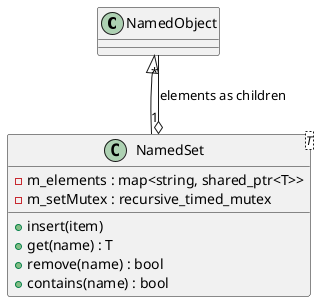

# NamedSet<T>

## [IMPL-CLASSES-001] Description
The `NamedSet` class is a template-based `NamedObject` that manages a collection of unique elements of type `T` (where `T` must derive from `NamedObject`). Unlike `NamedMap`, which uses explicit keys, `NamedSet` identifies and indexes its elements using their own intrinsic names (retrieved via `getName()`).

In the Quasar tree, the elements are attached as direct children. `NamedSet` ensures that if an object with a name already present in the set is inserted, the existing hierarchical child is replaced with the new one, maintaining both the internal collection and the tree structure in sync.

## [IMPL-CLASSES-002] Methods
- `create(name, parent)`: Static factory method.
- `insert(item)`: Adds an item to the set. If an item with the same name already exists, it is replaced. The item is attached as a child.
- `get(name)`: Thread-safe retrieval of an item by its name. Throws `std::out_of_range` if not found.
- `contains(name)`: Checks if an object with the given name is member of the set.
- `remove(name)`: Deletes an entry from both the internal collection and the hierarchical child list.
- `size()`: Returns the number of unique elements.
- `begin()`, `end()`: Provides iterators for set-style traversal.

## [IMPL-CLASSES-003] Attributes
- `m_elements`: `std::map<string, shared_ptr<T>>` - The internal storage, using object names as keys.
- `m_setMutex`: `std::recursive_timed_mutex` - Ensures thread-safe access to the collection.

## [IMPL-CLASSES-004] Relations
- Inherits from `NamedObject`.
- Contains multiple objects of type `T` (deriving from `NamedObject`).

## [IMPL-CLASSES-008] Class Diagram

