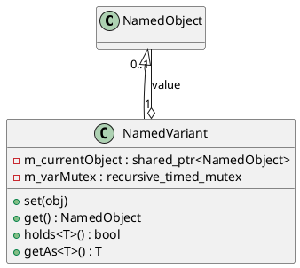

# NamedVariant

## [IMPL-CLASSES-001] Description
The `NamedVariant` class is a specialized `NamedObject` that acts as a type-safe dynamic container. It wraps exactly one child `NamedObject`, effectively providing a "union" or "variant" capability within the Quasar hierarchy. The held object is always assigned the name "value" internally to ensure a consistent path for external access.

`NamedVariant` is useful for representing fields whose type can change at runtime (e.g., a polymorphic sensor reading or a configurable property). It provides template-based helpers for type checking and safe casting.

## [IMPL-CLASSES-002] Methods
- `create(name, parent)`: Static factory method.
- `set(obj)`: Thread-safe replacement of the currently held object. The new object is automatically renamed to "value" and attached as a child.
- `get()`: Returns the currently held `NamedObject`.
- `holds<T>()`: Template method to check if the contained object is of type `T`.
- `getAs<T>()`: Template method to retrieve the contained object cast to type `T`. Throws if the type does not match or if the variant is empty.
- `clone(policy)`: Creates a new `NamedVariant` and clones the contained object if one exists.

## [IMPL-CLASSES-003] Attributes
- `m_currentObject`: `shared_ptr<NamedObject>` - Reference to the currently held value.
- `m_varMutex`: `recursive_timed_mutex` - Protects against concurrent set/get operations.

## [IMPL-CLASSES-004] Relations
- Inherits from `NamedObject`.
- Owns a single child `NamedObject` named "value".

## [IMPL-CLASSES-008] Class Diagram

