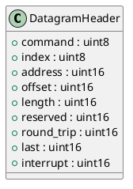

# DatagramHeader

## [IMPL-CLASSES-001] Description
The `DatagramHeader` struct represents the 10-byte header of an individual EtherCAT datagram. It includes the command, addressing information (index, address, offset), length, and status flags (More bit, Interrupt). It is aligned to 1 byte (packed).

## [IMPL-CLASSES-002] Methods
- Implicit default constructor.

## [IMPL-CLASSES-003] Attributes
- `command`: `uint8_t` - The EtherCAT command (e.g., APRD, BWR).
- `index`: `uint8_t` - The sequence index.
- `address`: `uint16_t` - The slave address (ADP).
- `offset`: `uint16_t` - The register offset (ADO).
- `length`: `uint16_t` (11 bits) - The data length.
- `reserved`: `uint16_t` (3 bits) - Reserved.
- `round_trip`: `uint16_t` (1 bit) - Circulating frame indicator.
- `last`: `uint16_t` (1 bit) - "More" bit (0 = Last, 1 = More).
- `interrupt`: `uint16_t` - Interrupt request.

## [IMPL-CLASSES-004] Relations
- Used by `FrameBuilder` to construct datagrams.

## [IMPL-CLASSES-005] Dependencies
- None.

## [IMPL-CLASSES-006] Tests
- `test_broadcast_read.cpp`.

## [IMPL-CLASSES-007] Examples
- Structure layout matches the wire format.

## [IMPL-CLASSES-008] Class Diagram

