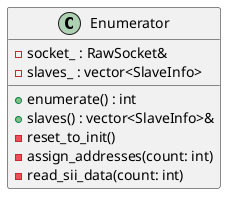

# Enumerator

## [IMPL-CLASSES-001] Description
The `Enumerator` class manages the discovery and initial configuration of EtherCAT slaves on the network. Its responsibilities include resetting slaves to the INIT state, counting slaves via broadcast read, assigning station addresses, reading slave identity and capabilities from the SII (EEPROM), and mapping the network topology.

## [IMPL-CLASSES-002] Methods
- `Enumerator(RawSocket &socket)`: Constructor.
- `int enumerate()`: Orchestrates the full enumeration process. Returns the number of slaves found.
- `const std::vector<SlaveInfo> &slaves() const`: Returns the list of discovered slaves.
- `int broadcast_read_count()`: Sends a BRD to register 0x0000 to count slaves.
- `void reset_to_init()`: Resets all slaves to a default state and transitions them to INIT.
- `void assign_addresses(int count)`: Assigns unique station addresses (starting at 0x1001) to each slave.
- `void read_sii_data(int count)`: Reads mandatory identity and category data from each slave's EEPROM.
- `void read_sii_categories(int slave_idx)`: Parses specific SII categories (General, Strings, SyncManagers).
- `void map_topology(int count)`: Identifies parent-child relationships in the EtherCAT chain.
- `uint32_t read_sii_word(uint16_t slave_cfg_addr, uint16_t word_addr)`: Helper to read a 16-bit word (or 32-bit if supported) from SII.
- `uint16_t find_sii_category(uint16_t slave_cfg_addr, uint16_t cat_type)`: Locates the start of an SII category.
- `std::string read_sii_string(uint16_t slave_cfg_addr, uint8_t string_idx)`: Reads a string from the SII Strings category.

## [IMPL-CLASSES-003] Attributes
- `socket_`: `RawSocket&` - Reference to the transport socket.
- `slaves_`: `std::vector<SlaveInfo>` - Collection of discovered slave information.
- `current_idx_`: `uint8_t` - Counter for EtherCAT datagram indices.

## [IMPL-CLASSES-004] Relations
- Uses `RawSocket` for communication.
- Uses `FrameBuilder` to construct frames.
- Populates `SlaveInfo` structures.

## [IMPL-CLASSES-005] Dependencies
- `resoem/RawSocket.hpp`
- `resoem/Slave.hpp`
- `resoem/EtherCATFrame.hpp`

## [IMPL-CLASSES-006] Tests
- `test_enumeration.cpp`: Verifies discovery, address assignment, and SII parsing for connected slaves.

## [IMPL-CLASSES-007] Examples
- Enumerating the bus:
  ```cpp
  RawSocket socket("eth0");
  Enumerator enumerator(socket);
  int count = enumerator.enumerate();
  for (const auto& slave : enumerator.slaves()) {
      std::cout << "Found: " << slave.name << "
";
  }
  ```

## [IMPL-CLASSES-008] Class Diagram

