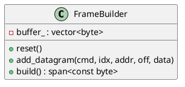

# FrameBuilder

## [IMPL-CLASSES-001] Description
The `FrameBuilder` class is a helper for constructing EtherCAT frames. It manages an internal buffer and provides methods to add EtherCAT datagrams. It handles the details of Ethernet headers, EtherCAT frame headers, and the "More" bit logic for chained datagrams, as well as minimum frame padding.

## [IMPL-CLASSES-002] Methods
- `FrameBuilder()`: Constructor. Reserves space for a standard MTU frame.
- `void reset()`: Resets the internal buffer to an empty state, ready for new datagrams.
- `void add_datagram(uint8_t cmd, uint8_t idx, uint16_t addr, uint16_t off, std::span<const byte> data)`: Appends an EtherCAT datagram to the frame.
- `std::span<const byte> build()`: Finalizes the frame by filling in the Ethernet and EtherCAT headers, fixing up "More" bits in datagram headers, and padding to the minimum Ethernet size (64 bytes).
- `const std::vector<byte> &buffer() const`: Returns the internal raw buffer.

## [IMPL-CLASSES-003] Attributes
- `buffer_`: `std::vector<byte>` - The internal storage for the frame being built.

## [IMPL-CLASSES-004] Relations
- Used by `Enumerator` and `MailboxHandler` to construct command frames.

## [IMPL-CLASSES-005] Dependencies
- `resoem/common.hpp`
- `resoem/EtherCATFrame.hpp`

## [IMPL-CLASSES-006] Tests
- `test_broadcast_read.cpp`: Verifies the construction of a simple BRD frame.

## [IMPL-CLASSES-007] Examples
- Building a broadcast read frame:
  ```cpp
  FrameBuilder builder;
  uint8_t data[2] = {0, 0};
  builder.add_datagram(cmds::BRD, 0x01, 0x0000, 0x0000, data);
  auto frame = builder.build();
  ```

## [IMPL-CLASSES-008] Class Diagram

