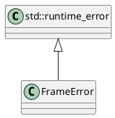

# FrameError

## [IMPL-CLASSES-001] Description
The `FrameError` class is a runtime exception used to indicate malformed frames or encoding/decoding errors within the `resoem` module. It inherits from `std::runtime_error`.

## [IMPL-CLASSES-002] Methods
- `FrameError(const std::string& what_arg)`: Constructor.
- `FrameError(const char* what_arg)`: Constructor.

## [IMPL-CLASSES-003] Attributes
- None.

## [IMPL-CLASSES-004] Relations
- None specific.

## [IMPL-CLASSES-005] Dependencies
- `std::runtime_error`

## [IMPL-CLASSES-006] Tests
- Indirectly covered by frame building tests.

## [IMPL-CLASSES-007] Examples
- Throwing an error:
  ```cpp
  throw FrameError("Invalid frame length");
  ```

## [IMPL-CLASSES-008] Class Diagram

