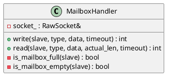

# MailboxHandler

## [IMPL-CLASSES-001] Description
The `MailboxHandler` class implements the EtherCAT mailbox communication protocol. It provides methods to read from and write to a slave's mailbox via SyncManagers. It handles mailbox headers, counter toggling, and polling the SyncManager status registers to ensure the mailbox is ready for data transfer.

## [IMPL-CLASSES-002] Methods
- `MailboxHandler(RawSocket &socket)`: Constructor.
- `int write(SlaveInfo &slave, mailbox::Type type, std::span<const byte> data, std::chrono::microseconds timeout)`: Writes data to the slave's outgoing mailbox (MbxOut). Returns the Working Counter (WKC).
- `int read(SlaveInfo &slave, mailbox::Type &type, std::span<byte> data, size_t &actual_len, std::chrono::microseconds timeout)`: Reads data from the slave's incoming mailbox (MbxIn). Returns the WKC.
- `bool is_mailbox_full(const SlaveInfo &slave)`: Checks if the slave's MbxIn SyncManager has data ready to be read.
- `bool is_mailbox_empty(const SlaveInfo &slave)`: Checks if the slave's MbxOut SyncManager is empty and ready for a new write.

## [IMPL-CLASSES-003] Attributes
- `socket_`: `RawSocket&` - Reference to the transport socket.
- `current_idx_`: `uint8_t` - Counter for EtherCAT datagram indices.

## [IMPL-CLASSES-004] Relations
- Uses `RawSocket` for communication.
- Used by `CoEHandler` to transport CANopen over EtherCAT datagrams.
- Depends on `SlaveInfo` for mailbox offsets and lengths.

## [IMPL-CLASSES-005] Dependencies
- `resoem/RawSocket.hpp`
- `resoem/Slave.hpp`
- `resoem/EtherCATTypes.hpp`

## [IMPL-CLASSES-006] Tests
- `test_coe_upload.cpp`: Indirectly tests `MailboxHandler` via SDO read operations.

## [IMPL-CLASSES-007] Examples
- Sending a raw mailbox message:
  ```cpp
  MailboxHandler mbx(socket);
  std::vector<byte> data = { ... };
  mbx.write(slave, mailbox::COE, data);
  ```

## [IMPL-CLASSES-008] Class Diagram

