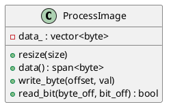

# ProcessImage

## [IMPL-CLASSES-001] Description
The `ProcessImage` class manages the logical representation of all exchangeable process data (Process Data Objects - PDO) on the EtherCAT network. It provides a contiguous byte buffer that aggregates all slave inputs and outputs, as mapped by the FMMU (Fieldbus Memory Management Unit) during the configuration phase. 

It provides fine-grained accessors for reading and writing data at both byte and bit granularity, enabling high-level logic to interact with hardware registers without needing to handle the underlying Ethernet frame mechanics directly.

## [IMPL-CLASSES-002] Methods
- `resize(size)`: Adjusts the buffer capacity to accommodate the network's logical memory map.
- `size()`: Returns the total size of the logical image in bytes.
- `data()`: Provides a `std::span` for zero-copy access to the raw buffer.
- `write_byte(offset, value)`, `read_byte(offset)`: Byte-level accessors.
- `write_bit(byte_offset, bit_offset, value)`, `read_bit(byte_offset, bit_offset)`: Bit-level accessors.

## [IMPL-CLASSES-003] Attributes
- `data_`: `std::vector<byte>` - The internal storage for the logical memory image.

## [IMPL-CLASSES-008] Class Diagram

