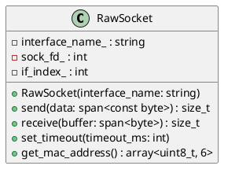

# RawSocket

## [IMPL-CLASSES-001] Description
The `RawSocket` class provides a low-level interface to a Linux network interface using raw sockets (`AF_PACKET`). It is specifically designed for EtherCAT communication, bypassing the standard TCP/IP stack to send and receive Ethernet frames with the EtherCAT EtherType (0x88A4).

## [IMPL-CLASSES-002] Methods
- `RawSocket(const std::string &interface_name)`: Constructor. Opens and binds a raw socket to the specified interface. Sets a default timeout of 100ms.
- `~RawSocket()`: Destructor. Closes the socket file descriptor.
- `size_t send(std::span<const byte> data)`: Sends a raw Ethernet frame.
- `size_t receive(std::span<byte> buffer)`: Receives a raw Ethernet frame. Blocks until a frame is received or the timeout expires.
- `void set_timeout(int timeout_ms)`: Configures the receive and send timeouts for the socket.
- `const std::string &interface_name() const`: Returns the name of the bound interface.
- `std::array<uint8_t, 6> get_mac_address() const`: Retrieves the hardware MAC address of the bound interface.

## [IMPL-CLASSES-003] Attributes
- `interface_name_`: `std::string` - The name of the network interface.
- `sock_fd_`: `int` - The file descriptor for the raw socket.
- `if_index_`: `int` - The Linux interface index.

## [IMPL-CLASSES-004] Relations
- Used by `Enumerator` and `MailboxHandler` for transport.

## [IMPL-CLASSES-005] Dependencies
- `linux/if_packet.h`
- `net/ethernet.h`
- `sys/socket.h`
- `resoem/common.hpp`

## [IMPL-CLASSES-006] Tests
- `test_broadcast_read.cpp`: Verifies socket opening, MAC retrieval, and basic send/receive.

## [IMPL-CLASSES-007] Examples
- Opening a socket and sending a frame:
  ```cpp
  RawSocket socket("eth0");
  auto mac = socket.get_mac_address();
  socket.send(frame_data);
  ```

## [IMPL-CLASSES-008] Class Diagram

