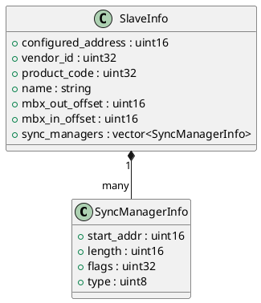

# SlaveInfo

## [IMPL-CLASSES-001] Description
The `SlaveInfo` and `SyncManagerInfo` structures hold the identity, configuration, and status of an EtherCAT slave. `SlaveInfo` is populated during the enumeration phase and updated during mailbox or process data operations. It includes network addresses, hardware identifiers (Vendor, Product), and mailbox/SyncManager configurations.

## [IMPL-CLASSES-002] Methods
- `SlaveInfo()`: Default constructor (POD-like).
- `SyncManagerInfo()`: Default constructor (POD-like).

## [IMPL-CLASSES-003] Attributes
### SyncManagerInfo
- `start_addr`: `uint16_t` - Physical start address of the SM.
- `length`: `uint16_t` - Size of the SM buffer.
- `flags`: `uint32_t` - Configuration and status flags.
- `type`: `uint8_t` - SM Type (1: MbxOut, 2: MbxIn, 3: Outputs, 4: Inputs).

### SlaveInfo
- `configured_address`: `uint16_t` - The assigned station address.
- `alias_address`: `uint16_t` - The alias address from EEPROM.
- `vendor_id`: `uint32_t` - Hardware vendor identifier.
- `product_code`: `uint32_t` - Hardware product identifier.
- `name`: `std::string` - Human-readable device name from SII.
- `ports_link_status`: `uint8_t` - Link status of the 4 ESC ports.
- `parent_index`: `int` - Index of the parent slave in the chain.
- `mbx_out_offset`: `uint16_t` - Start address for outgoing mailbox.
- `mbx_out_length`: `uint16_t` - Length of outgoing mailbox.
- `mbx_in_offset`: `uint16_t` - Start address for incoming mailbox.
- `mbx_in_length`: `uint16_t` - Length of incoming mailbox.
- `mbx_cnt`: `uint8_t` - Current mailbox toggle counter.
- `sync_managers`: `vector<SyncManagerInfo>` - List of configured SyncManagers.

## [IMPL-CLASSES-004] Relations
- Contained within `Enumerator`.
- Passed as a reference to `MailboxHandler` and `CoEHandler`.

## [IMPL-CLASSES-005] Dependencies
- `resoem/EtherCATTypes.hpp`

## [IMPL-CLASSES-006] Tests
- `test_enumeration.cpp`: Populates and displays `SlaveInfo` attributes.

## [IMPL-CLASSES-007] Examples
- Accessing slave name:
  ```cpp
  std::cout << "Slave: " << slave.name << "
";
  ```

## [IMPL-CLASSES-008] Class Diagram

