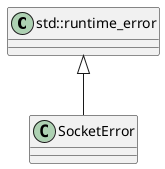

# SocketError

## [IMPL-CLASSES-001] Description
The `SocketError` class is a runtime exception used to indicate failures in low-level socket operations within the `resoem` module. It inherits from `std::runtime_error`.

## [IMPL-CLASSES-002] Methods
- `SocketError(const std::string& what_arg)`: Constructor accepting an error message.
- `SocketError(const char* what_arg)`: Constructor accepting a C-string error message.

## [IMPL-CLASSES-003] Attributes
- None (inherits `what` from `std::runtime_error`).

## [IMPL-CLASSES-004] Relations
- Thrown by `RawSocket`.

## [IMPL-CLASSES-005] Dependencies
- `std::runtime_error`

## [IMPL-CLASSES-006] Tests
- `test_broadcast_read.cpp`: Catches exceptions derived from `std::exception`, covering `SocketError`.

## [IMPL-CLASSES-007] Examples
- Throwing an error:
  ```cpp
  throw SocketError("Failed to bind socket");
  ```

## [IMPL-CLASSES-008] Class Diagram

