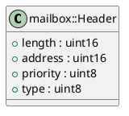

# Header

## [IMPL-CLASSES-001] Description
The `mailbox::Header` struct represents the 6-byte header used in EtherCAT Mailbox communication. It encapsulates the length, address, priority, and mailbox type/counter information. It is packed to match the wire format.

## [IMPL-CLASSES-002] Methods
- Implicit default constructor.

## [IMPL-CLASSES-003] Attributes
- `length`: `uint16_t` - Length of the mailbox data following the header.
- `address`: `uint16_t` - Address of the station (usually 0 for master).
- `priority`: `uint8_t` - Priority (bits 0-1).
- `type`: `uint8_t` - Contains the Mailbox Type (bits 0-3), Counter (bits 4-6), and Reserved (bit 7).

## [IMPL-CLASSES-004] Relations
- Used by `MailboxHandler`.

## [IMPL-CLASSES-005] Dependencies
- `resoem/EtherCATTypes.hpp` (enums)

## [IMPL-CLASSES-006] Tests
- `test_coe_upload.cpp` (via `MailboxHandler`).

## [IMPL-CLASSES-007] Examples
- Setting type and counter:
  ```cpp
  header.type = static_cast<uint8_t>(mailbox::COE) | (cnt << 4);
  ```

## [IMPL-CLASSES-008] Class Diagram

