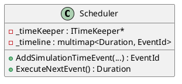

# Scheduler

## [IMPL-CLASSES-001] Description
The `Scheduler` class implements the `Smp::Services::IScheduler` interface. It manages simulation events scheduled at specific times (Simulation Time, Mission Time, Epoch Time, or Zulu Time) and immediate events. It maintains a timeline of events ordered by their scheduled simulation time.

## [IMPL-CLASSES-002] Methods
- `Scheduler(Smp::Services::ITimeKeeper *timeKeeper, Smp::Services::ILogger *logger)`: Constructor.
- `EventId AddImmediateEvent(const Smp::IEntryPoint *entryPoint)`: Schedules an event for immediate execution.
- `EventId AddSimulationTimeEvent(...)`: Schedules an event at a specific simulation time with optional cycle and repeat logic.
- `EventId AddMissionTimeEvent(...)`, `AddEpochTimeEvent(...)`, `AddZuluTimeEvent(...)`: Schedule events based on different time references.
- `Smp::Duration ExecuteNextEvent()`: Executes the next scheduled event in the timeline. Returns the time of the next event.
- `bool HasEvents()`: Checks if there are any events scheduled or pending.

## [IMPL-CLASSES-003] Attributes
- `_timeKeeper`: `ITimeKeeper*` - Reference to the time keeper for time conversions.
- `_logger`: `ILogger*` - Reference to the logger for reporting.
- `_events`: `std::map<EventId, SchedulerEvent>` - Storage for all event data.
- `_timeline`: `std::multimap<Smp::Duration, EventId>` - Ordered timeline of events by simulation time.

## [IMPL-CLASSES-004] Relations
- Implements `Smp::Services::IScheduler`.
- Inherits from `core::Object`.
- Uses `ITimeKeeper` and `ILogger`.

## [IMPL-CLASSES-005] Dependencies
- `Smp/Services/IScheduler.h`
- `core/Object.hpp`

## [IMPL-CLASSES-006] Tests
- Likely tested in simulation integration tests (e.g., `test_basic_simulation.cpp`).

## [IMPL-CLASSES-007] Examples
- Scheduling a cyclic event:
  ```cpp
  scheduler->AddSimulationTimeEvent(entryPoint, 1000, 100, 0); // Start at 1000, repeat every 100
  ```

## [IMPL-CLASSES-008] Class Diagram

