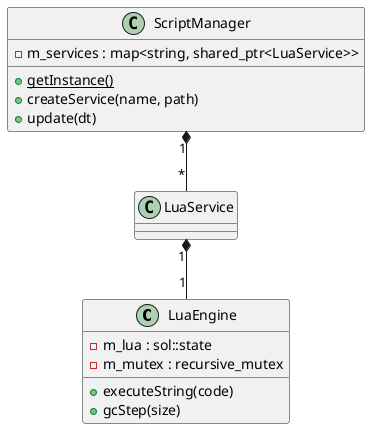

# LuaEngine and ScriptManager

The `scripting` module provides a robust, real-time capable environment for executing Lua 5.4 scripts within the Quasar framework.

## LuaEngine

### [IMPL-CLASSES-001] Description
The `LuaEngine` class is a secure wrapper around a `sol::state`. It provides controlled execution of Lua code, handles errors gracefully via `LuaExecutionException`, and includes features for real-time garbage collection management. It is designed to be thread-safe through an internal recursive mutex.

### [IMPL-CLASSES-002] Methods
- `LuaEngine()`: Constructor. Initializes the Lua state and loads standard libraries.
- `executeString(code)`: Safely runs a string of Lua code. Returns a `sol::protected_function_result`.
- `gcStep(step_size)`: Performs an incremental garbage collection step. Crucial for maintaining deterministic timing in industrial applications.
- `acquireLock()`: Returns a RAII lock for safe multi-threaded access to the state.
- `setupSandbox()`: Internal method to restrict the Lua environment for security.

---

## ScriptManager

### [IMPL-CLASSES-001] Description
The `ScriptManager` is a singleton orchestrator that manages the lifecycle of multiple `LuaService` instances. It handles the dynamic creation, updating, and shutdown of script-based services. It also defines the global sandboxing policy used to secure the execution environment.

### [IMPL-CLASSES-002] Methods
- `getInstance()`: Returns the global orchestrator instance.
- `createService(name, scriptPath)`: Instantiates and starts a new managed script service.
- `stopService(name)`: Terminates a service and removes it from the registry.
- `update(dt)`: Periodic hook to allow scripts to perform time-sliced processing.
- `tickGC(stepSize)`: Coordinates incremental GC steps across all active engines to prevent execution spikes.
- `createSandbox(lua)`: Static utility to create a restricted global environment (`_G`) for a Lua state.

### [IMPL-CLASSES-008] Class Diagram

