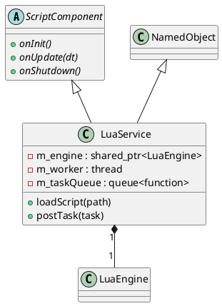

# LuaService and ScriptComponent

The `scripting` module allows defining autonomous behavior through stateful Lua services that respond to system events or periodic timers.

## ScriptComponent

### [IMPL-CLASSES-001] Description
`ScriptComponent` is an abstract interface defining the standard lifecycle hooks for any scriptable entity. 

### [IMPL-CLASSES-002] Methods
- `onInit()`: Called once when the script is loaded.
- `onUpdate(dt)`: Called periodically to perform time-sliced processing.
- `onShutdown()`: Called before the script state is destroyed.

---

## LuaService

### [IMPL-CLASSES-001] Description
The `LuaService` class is a persistent operational entity that owns a private `LuaEngine`. It implements the `ScriptComponent` lifecycle and provides a dedicated worker thread for asynchronous execution. This allows Lua scripts to run complex background tasks (e.g., protocol masters, data aggregators) without blocking the main Quasar execution loops.

It supports a task-posting mechanism for safe cross-thread communication with the Lua state.

### [IMPL-CLASSES-002] Methods
- `create(name, parent)`: Static factory method.
- `loadScript(path)`: Reads and executes a Lua file to initialize the service state.
- `postTask(task)`: Queues a C++ function to be executed safely on the service's private worker thread.
- `workerLoop()`: Internal method running the dedicated thread. It processes the task queue and executes the periodic `onUpdate` hook.
- `gcStep(size)`: Performs thread-safe incremental garbage collection.

### [IMPL-CLASSES-003] Attributes
- `m_engine`: `std::shared_ptr<LuaEngine>` - The private execution environment.
- `m_worker`: `std::thread` - The dedicated background thread.
- `m_taskQueue`: `std::queue<std::function<void()>>` - Thread-safe FIFO for incoming execution requests.
- `m_stateMutex`: `std::recursive_timed_mutex` - Protects the Lua state during concurrent access.

### [IMPL-CLASSES-004] Relations
- Inherits from `NamedObject` and `ScriptComponent`.
- Aggregates one `LuaEngine`.
- Managed by `ScriptManager`.

### [IMPL-CLASSES-008] Class Diagram

