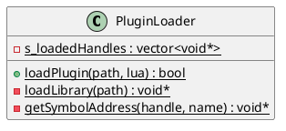

# PluginLoader

## [IMPL-CLASSES-001] Description
The `PluginLoader` class provides the infrastructure for Quasar's dynamic extensibility. It allows the scripting engine to load compiled C++ shared libraries at runtime, enabling the registration of new `ScriptableNamedObject` types, services, or custom C++ bindings without requiring a full system recompilation. 

It implements a standardized plugin contract: it searches for a specific entry point symbol (`registerPluginComponents`) in the target library and invokes it, passing the Lua state context.

## [IMPL-CLASSES-002] Methods
- `loadPlugin(libraryPath, lua)`: Static method. Orchestrates the loading sequence: opens the library, locates the registration symbol, and executes the plugin's binding logic.
- `loadLibrary(path)`, `getSymbolAddress(handle, name)`: Low-level platform-specific wrappers (using `dlopen`/`dlsym` on Linux) for library management.

## [IMPL-CLASSES-003] Attributes
- `s_loadedHandles`: `std::vector<void*>` - Static collection of handles to open libraries. These are kept open for the duration of the process to ensure that plugin code and data remain resident in memory while Lua objects depend on them.

## [IMPL-CLASSES-005] Dependencies
- `sol2` library.
- System dynamic loader (e.g., `libdl` on Linux).

## [IMPL-CLASSES-008] Class Diagram

