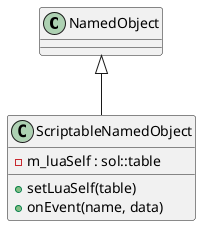

# ScriptableNamedObject

## [IMPL-CLASSES-001] Description
The `ScriptableNamedObject` class is a specialized version of `NamedObject` designed for hybrid C++/Lua development. It allows a C++ object to be linked to a Lua table (the `luaSelf`), which can then provide dynamic overrides for virtual methods (such as `getType` or `clone`). This mechanism enables developers to extend the core system's behavior directly from scripts, creating "script-defined" objects that behave like native C++ components within the Quasar hierarchy.

It also provides an `onEvent` hook for generic communication between the C++ engine and the script context.

## [IMPL-CLASSES-002] Methods
- `create(name, parent)`: Static factory method.
- `setLuaSelf(table)`: Associates a Lua table with this object instance.
- `getLuaSelf()`: Retrieves the associated Lua table.
- `getType()`: Overridden. Checks the `luaSelf` table for a `getType` function and calls it if present; otherwise, returns the default.
- `clone(policy)`: Overridden. Checks `luaSelf` for a custom `clone` implementation.
- `onEvent(eventName, data)`: Dispatches a generic event to the Lua function of the same name.

## [IMPL-CLASSES-003] Attributes
- `m_luaSelf`: `sol::table` - A persistent reference to the Lua object that provides the logic overrides.

## [IMPL-CLASSES-004] Relations
- Inherits from `quasar::named::NamedObject`.

## [IMPL-CLASSES-008] Class Diagram

