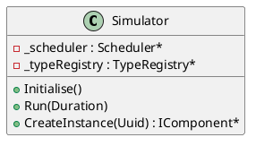

# Simulator

## [IMPL-CLASSES-001] Description
The `Simulator` class is the central orchestrator of the simulation. It implements `Smp::IDynamicSimulator` and manages simulation states, component lifecycles (Publish, Configure, Connect), factory registration, and time progression. It integrates services like the Logger, TimeKeeper, Scheduler, and EventManager.

## [IMPL-CLASSES-002] Methods
- `Simulator()`: Constructor.
- `void Initialise()`: Transitions the simulator to the Initialising state, calling `Initialise()` on all models.
- `void Run(Smp::Duration time)`: Runs the simulation for a specified duration by executing events from the scheduler.
- `void RegisterFactory(Smp::IFactory *factory)`: Registers a component factory for dynamic instantiation.
- `Smp::IComponent* CreateInstance(Uuid uuid, ...)`: Creates an instance of a component using a registered factory.
- `void LoadLibrary(String8 path, ...)`: Dynamically loads a library (shared object) and registers its factories.

## [IMPL-CLASSES-003] Attributes
- `_simState`: `SimulatorStateKind` - Current state of the simulation (Building, Initialising, Executing, etc.).
- `_scheduler`: `Scheduler*` - Internal scheduler for event management.
- `_typeRegistry`: `TypeRegistry*` - Registry for SMP types.
- `_modelsContainer`: `Container*` - Container for all models in the simulation.

## [IMPL-CLASSES-004] Relations
- Implements `Smp::IDynamicSimulator`.
- Contains `Scheduler`, `TypeRegistry`, `EventManager`, etc.
- Manages `IModel` instances.

## [IMPL-CLASSES-005] Dependencies
- `Smp/IDynamicSimulator.h`
- `sim/TypeRegistry.hpp`
- `sched/Scheduler.hpp`

## [IMPL-CLASSES-006] Tests
- `test_basic_simulation.cpp`: Comprehensive test of simulator lifecycle and execution.

## [IMPL-CLASSES-007] Examples
- Basic setup:
  ```cpp
  Simulator sim;
  sim.Publish();
  sim.Configure(logger, linkRegistry);
  sim.Connect(&sim);
  sim.Initialise();
  sim.Run(1000000); // Run for 1ms
  ```

## [IMPL-CLASSES-008] Class Diagram

