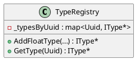

# TypeRegistry

## [IMPL-CLASSES-001] Description
The `TypeRegistry` class implements `Smp::Publication::ITypeRegistry`. It serves as a central repository for all data types used within the SMP simulation, including primitive types, structures, arrays, and classes. It ensures that types are uniquely identified by UUIDs.

## [IMPL-CLASSES-002] Methods
- `AddFloatType(...)`, `AddIntegerType(...)`: Add primitive-based types with range constraints.
- `AddArrayType(...)`: Adds a new array type defined by an item type and count.
- `AddStructureType(...)`: Adds a new structure type.
- `AddClassType(...)`: Adds a class type with inheritance support.
- `IType* GetType(Uuid uuid)`: Retrieves a type definition by its unique ID.

## [IMPL-CLASSES-003] Attributes
- `_typesByUuid`: `std::map<Uuid, unique_ptr<IType>>` - Maps UUIDs to type definitions.
- `_typesByKind`: `std::map<PrimitiveTypeKind, IType*>` - Cache for primitive types.

## [IMPL-CLASSES-004] Relations
- Implements `Smp::Publication::ITypeRegistry`.
- Used by the `Simulator` and components during the `Publish` phase.

## [IMPL-CLASSES-005] Dependencies
- `Smp/Publication/ITypeRegistry.h`

## [IMPL-CLASSES-006] Tests
- Tested via `Simulator` tests.

## [IMPL-CLASSES-007] Examples
- Adding a type:
  ```cpp
  registry->AddIntegerType("MyInt", "Description", uuid, 0, 100, "units");
  ```

## [IMPL-CLASSES-008] Class Diagram

