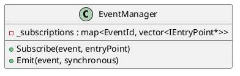

# EventManager

## [IMPL-CLASSES-001] Description
The `EventManager` class implements `Smp::Services::IEventManager`. It manages a publisher-subscriber system for discrete simulation events. Components can subscribe to named events and trigger (emit) them synchronously or asynchronously.

## [IMPL-CLASSES-002] Methods
- `EventId QueryEventId(String8 name)`: Returns the ID for a named event, creating it if it doesn't exist.
- `void Subscribe(EventId event, const IEntryPoint *entryPoint)`: Subscribes an entry point to an event.
- `void Emit(EventId event, Bool synchronous)`: Triggers an event, executing all subscribed entry points.

## [IMPL-CLASSES-003] Attributes
- `_subscriptions`: `map<EventId, vector<const IEntryPoint*>>` - Stores the mapping of events to subscribers.
- `_eventIds`: `map<string, EventId>` - Maps event names to their IDs.

## [IMPL-CLASSES-004] Relations
- Implements `Smp::Services::IEventManager`.
- Allows decoupling between components.

## [IMPL-CLASSES-005] Dependencies
- `Smp/Services/IEventManager.h`

## [IMPL-CLASSES-006] Tests
- Verified in integration tests where events are used for inter-component communication.

## [IMPL-CLASSES-008] Class Diagram

